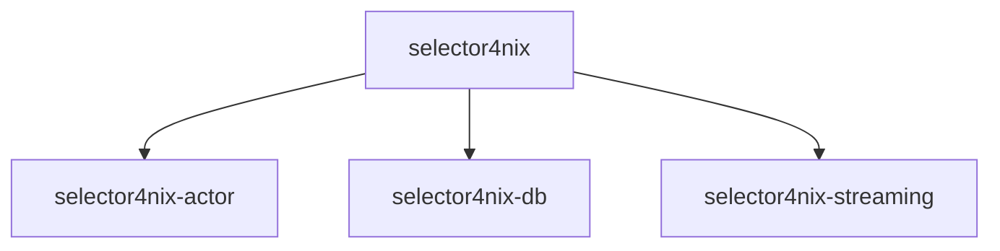

# Overview

## Crates

The workspace comprises several crates: the main application crate `selector4nix` and self-contained component libraries under `components/`. The main crate is the sole consumer of all three libraries, while the libraries themselves are independent of each other.

The main crate `selector4nix` produces the application binary. It contains the HTTP API, domain logic, and infrastructure adapters, and is responsible for wiring the component libraries together.

`selector4nix-actor` provides an actor framework with a registry that manages actor lifecycles keyed by a user-defined type, supporting optional capacity limits and expiration policies.

`selector4nix-db` provides an embedded key-value cache with TTL-based expiration and both on-disk and in-memory modes.

`selector4nix-streaming` provides a HTTP file streaming utility. It transparently selects between full streaming and chunked streaming based on whether the server supports HTTP Range requests. The chunked mode downloads file segments concurrently through a sliding window with per-host throttling.

## Layered Architecture

The project is organized into four layers, each with a distinct responsibility.

- API: Receives HTTP requests and maps them to use case invocations.
- Application: Orchestrates domain logic through use cases and actors.
- Domain: Contains pure business logic and abstractions for external dependencies.
- Infrastructure: Implements those abstractions with concrete technologies and handles configuration.

These layers are populated by several types of datatypes and components.

**Value**. An immutable piece of data compared by content rather than by identity. Store path hashes, URLs, and priorities are examples of values.

**Entity**. An object which has identity and mutable state with lifecycle transitions. Each entity encapsulates its own transition rules and exposes methods that compute the next state from the current state. Each entity should avoid depending on other entities, and direct composition and modification are strictly prohibited.

**Event**. A datatype which carries information about a change that one entity produces for others to consume. Events are the mechanism for cross-entity side effects. When an operation on one entity needs to affect another, the change is communicated through events rather than through direct access.

**Port**. A trait that declares what the domain needs from external services, such as fetching NAR info from a remote substituter or streaming a NAR file. The infrastructure layer provides concrete implementations of these ports.

**Repository**. A trait that declares persistence operations for an entity, such as loading and saving its state. Repositories are defined in the domain layer alongside ports and implemented in the infrastructure layer.

**Service**. Short for domain service. A component which organizes the business logic of a single entity that requires impure operations through ports or repositories. It exists for cohesion: related logic that needs external access is kept in one place rather than mixed into the entity. Instead of holding states of its own, the service receives the entity's current state and returns the updated state along with any results and events. When the logic affects other entities, the service produces events rather than modifying them directly.

**Actor**. A object that represents a single entity's runtime process and the concurrency boundary. It receives messages, loads the entity's state from its repository, delegates to the service for business logic, persists the result, and dispatches any events the interaction produced. Each actor processes one message at a time, so no two operations on the same entity overlap.

**Use Case**. Aka. application service. A component which corresponds to one externally-facing operation. When the API layer receives a request, it invokes the appropriate use case. The use case sends messages to one or more actors, dispatches the events that result from those interactions, and assembles the final response for the caller.
